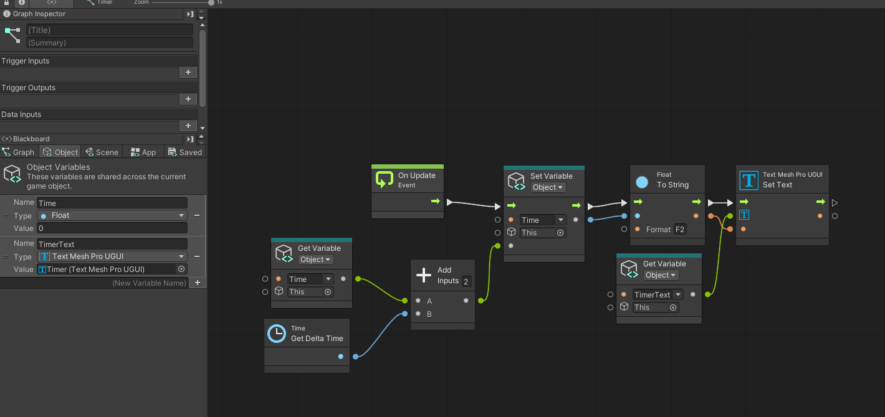
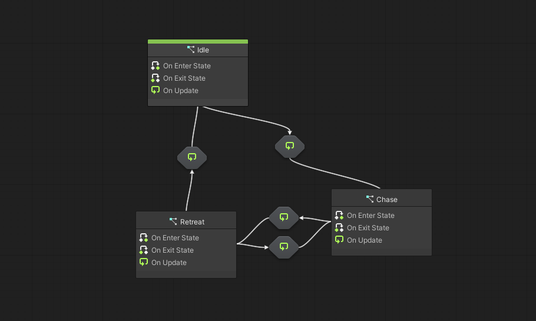
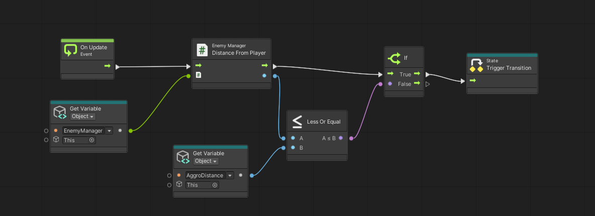

# GDIM33 Vertical Slice
## Milestone 1 Devlog

1. One visual graph in my project is the TimerGraph. This graph gets a reference to the text object in the game's UI and updates the text to match the time elapsed in the scene. The variable that is updated every frame is the Timer float variable that is formatted to the hundredths place when passed into the text variable. At the end of the level, a game over screen appears. In C#, the game over screen displays the final time using (float)Variables.Object(timer).Get("Time") to access the object variable.

2. 
In my new breakdown, I added a field for enemy state machines. These state machines are responsible for controlling the idle, chase, and retreat behaviors for the enemies. The enemies send data to the state machine such as the distance between the player and the enemy or the distance between the enemy and their checkpoint. When players are a certain distance away from the enemy, the enemy begins chasing them until the player outruns them. When the players outrun the enemy, they enter the retreat state where they begin to walk back to their checkpoint. Once the enemy reaches the checkpoint, the enemy enters the idle state where no behavior is executed until the player reenters the aggro radius.

To check these transitions, the EnemyManager has helper functions written in C# to check the distances between various gameobjects like the player and checkpoints. The EnemyState graph accesses the C# script to check these conditions OnUpdate. Additionally, within the C# script, I have also defined behaviors for each state (HandleIdleState, HandleChaseState, HandleRetreatState). These functions are called OnUpdate in their own respective states. This reduces visual clutter from the state graph and makes code easier to debug and maintain. By having these behaviors, the enemies are able to interact with the player and allow the player to easily shoot the enemies to gain movement speed.

## Milestone 2 Devlog
1.  __Have enemies attack the player__
    - Make a script called ColliderComponent that attaches to a gameobject parented to the enemy's hand. This is used to communicate with the main enemy script to detect collisions.
    - Attach the collider and script to the enemy.
    - Make a StateMachineBehavior script for the enemy's animator to reset attack values to make sure they can only hit the player once per attack.
    - Use the health interface I have previously made to damage the player

    __Have the player die when attacked by enemy (Simulate head being sliced off on death)__
    - Get a reference to the CinemachineVirtualCamera component
    - On death, add a rigidbody and sphere collider to the camera to simulate physics
    - Add a small force to the camera to push it off the character capsule
    - Ensure the follow target for the VirtualCamera is null

2. The task break-down helped organize my ideas into small, digestable pieces, ensuring I do not become overwhelmed. However, during the development of said feature, I realized I forgot to include many small problems I would run into. In the end, those bugs were easily fixed.

3. In my timer visual graph, I have a timer variable that is accessed by the UIManager when the player completes the level or dies. This variable is being accessed in C# through (float)Variables.Object(timer).Get("Time"). Additionally, in my state machine graph, I simply call functions like HandleIdle() and HandleChaseState() from my EnemyManager script. In the EnemyManager script, I also made functions to check the distance from the player which determines their overall behavior. 

4. The Unity feature I would like top be graded is my enemy behavior. Particularly how they react to the player when they get close enough and whether their attacks affect the enemy. Additionally, on death, the player's camera should fall off their body and roll around.

## Milestone 3 Devlog
Milestone 3 Devlog goes here.
## Milestone 4 Devlog
Milestone 4 Devlog goes here.
## Final Devlog
Final Devlog goes here.
## Open-source assets
- Cite any external assets used here!
