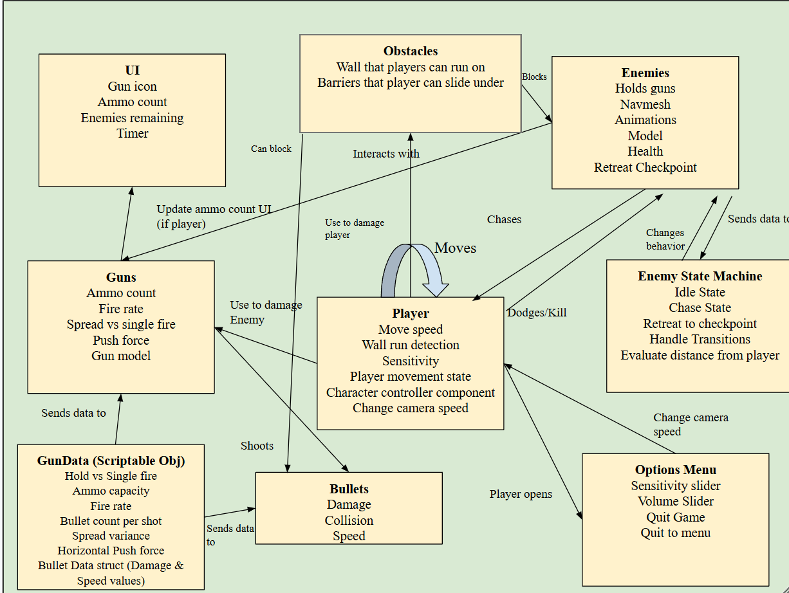

# GDIM33 Vertical Slice
## Milestone 1 Devlog

1. One visual graph in my project is the TimerGraph. This graph gets a reference to the text object in the game's UI and updates the text to match the time elapsed in the scene. The variable that is updated every frame is the Timer float variable that is formatted to the hundredths place when passed into the text variable. At the end of the level, a game over screen appears. In C#, the game over screen displays the final time using (float)Variables.Object(timer).Get("Time") to access the object variable.

2. 
In my new breakdown, I added a field for enemy state machines. These state machines are responsible for controlling the idle, chase, and retreat behaviors for the enemies. The enemies send data to the state machine such as the distance between the player and the enemy or the distance between the enemy and their checkpoint. When players are a certain distance away from the enemy, the enemy begins chasing them until the player outruns them. When the players outrun the enemy, they enter the retreat state where they begin to walk back to their checkpoint. Once the enemy reaches the checkpoint, the enemy enters the idle state where no behavior is executed until the player reenters the aggro radius.

To check these transitions, the EnemyManager has helper functions written in C# to check the distances between various gameobjects like the player and checkpoints. The EnemyState graph accesses the C# script to check these conditions OnUpdate. Additionally, within the C# script, I have also defined behaviors for each state (HandleIdleState, HandleChaseState, HandleRetreatState). These functions are called OnUpdate in their own respective states. This reduces visual clutter from the state graph and makes code easier to debug and maintain. 

## Milestone 2 Devlog
Milestone 2 Devlog goes here.
## Milestone 3 Devlog
Milestone 3 Devlog goes here.
## Milestone 4 Devlog
Milestone 4 Devlog goes here.
## Final Devlog
Final Devlog goes here.
## Open-source assets
- Cite any external assets used here!
